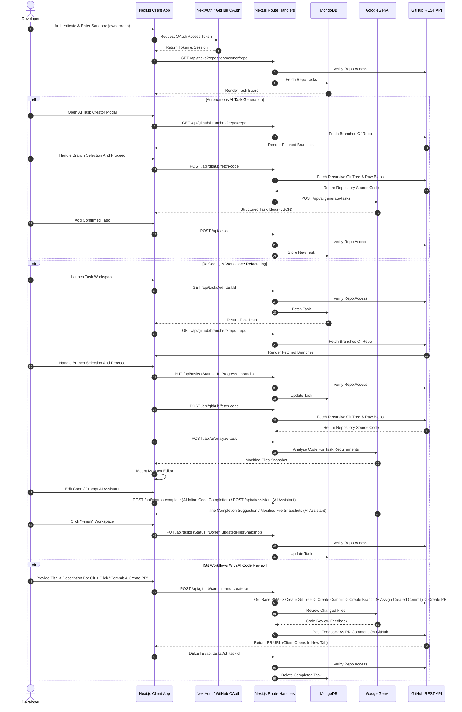

# Codentialist

Codentialist is an AI-driven development platform built with TypeScript, Next.js, MongoDB, and GoogleGenAI. It seamlessly bridges GitHub repository based sandbox management, AI codebase analysis, autonomous/manual task generation, autonomous/manual software development, real-time inline completions, AI assistant for additional modifications and automated "Git Commit (+ task specific branch creation) -> Pull Request Creation -> Automated AI Code Review" flow.

---

## Key Features

1. **AI Task Architect (Autonomous Feature Ideation)**

   - Scans full repository source codes using Gemini.
   - Generates up to 5 high-impact, innovative feature recommendations or technical refactoring tasks with titles and implementation descriptions.

2. **Multi-File Context-Aware AI Task Handler**

   - Ingests repository file snapshots along with task specifications.
   - Uses Gemini structured JSON schema to propose precise multi-file codebase modifications.

3. **Interactive Monaco Editor Workspace & Explorer**

   - Embedded VSCode-like Monaco Editor.
   - Advanced built-in tree-view `FileExplorer` (w/ recursive node nesting, sorting, collapsible folders, dynamic status badges, etc.).
   - Integrated AI Assistant sidebar panel for iterative refactor instructions.

4. **Low-Latency Inline Code Completion**

   - Real-time inline AI code completion registered via Monaco's `registerInlineCompletionsProvider`.
   - Uses cursor prefix and suffix context with debouncing and `AbortController` cancellation for fast, efficient AI completions.

5. **Automated Commit, PR Creation & AI Code Review Pipeline**

   - Git object construction via GitHub API (Trees, Commits, Refs).
   - Creates topic branch (`task-${taskId}`) and opens Pull Requests automatically.
   - Triggers an automated AI Code Review evaluating potential bugs, security vulnerabilities, clean code practices and requirement coverage. Then posting feedback directly to the PR discussion.

6. **GitHub OAuth & Access Validation Gatekeeper**

   - Secure authentication via NextAuth.
   - Strict repository-level security checking (`verifyRepoAccess`) verifying permissions before granting CRUD access to task records.

---

## Tech Stack

| Domain             | Technology / Library                         |
| :----------------- | :------------------------------------------- |
| **Framework**      | Next.js (For Frontend & Backend)             |
| **Language**       | TypeScript                                   |
| **Authentication** | NextAuth.js                                  |
| **AI Engine**      | Google Gen AI SDK (`@google/genai`)          |
| **Database**       | MongoDB & Mongoose                           |
| **Code Editor**    | `@monaco-editor/react`                       |
| **Styling**        | Tailwind CSS (For UX-friendly responsive UI) |

---

## System Architecture & Data Flow



---

## Directory Structure

```
codentialist/
├── README.md                       # Comprehensive project documentation
├── proxy.ts                        # Network request forwarding and proxy middleware logic
├── projectInfo.ts                  # Application metadata (title, description)
├── lib/
│   └── db.ts                       # Mongoose connection pooling helper
├── models/
│   └── Task.ts                     # MongoDB Mongoose schema for tasks and file snapshots
├── types/
│   └── workspace.ts                # TypeScript interfaces (IFileSnapshot, ITask, etc.)
├── app/
│   ├── globals.css                 # Tailwind CSS directives & some basic generic styles
│   ├── layout.tsx                  # Root layout with Inter font & NextAuthProvider
│   ├── page.tsx                    # Root page wrapping Home with Suspense
│   ├── workspace/
│   │   └── [taskId]/
│   │       └── page.tsx            # Dynamic workspace route for branch selection, IDE setup, etc.
│   └── api/
│       ├── ai/
│       │   ├── analyze-task/
│       │   │   └── route.ts        # Task requirement codebase analysis API
│       │   ├── assistant/
│       │   │   └── route.ts        # Interactive workspace AI refactoring API
│       │   ├── auto-complete/
│       │   │   └── route.ts        # AI inline code completion API
│       │   └── generate-tasks/
│       │       └── route.ts        # AI task generator API
│       ├── auth/
│       │   └── [...nextauth]/
│       │       └── route.ts        # NextAuth handler for GitHub OAuth
│       ├── github/
│       │   ├── branches/
│       │   │   └── route.ts        # Fetches GitHub repository branches
│       │   ├── commit-and-create-pr/
│       │   │   └── route.ts        # Low-level Git tree commit, assigning commit to new branch & PR creation (w/ AI Code Review)
│       │   └── fetch-code/
│       │       └── route.ts        # Fetches recursive file tree + blob content & then providing formatted files data
│       └── tasks/
│           └── route.ts            # CRUD endpoints for tasks (w/ access checks)
└── components/
    ├── CodeWorkspace.tsx           # Split-panel IDE containing Monaco, FileExplorer & AI Assistant
    ├── FileExplorer.tsx            # Advanced algorithmic files tree component
    ├── GridBackground.tsx          # Cyber vibe grid background with animation
    ├── Home.tsx                    # Home page content (auth gate, repo entry & task dashboard)
    ├── LoadingView.tsx             # Centered loading spinner layout
    ├── NextAuthProvider.tsx        # Client-side NextAuth SessionProvider wrapper
    ├── OrbsBackground.tsx          # Ambient glowing SVG background orbs
    └── TaskBoard.tsx               # Main task management UI, AI task creator & Git workflows
```

---

## API Design

All protected routes require an active NextAuth session containing a valid GitHub `accessToken`.

### 1. Authentication Endpoint

#### `GET/POST /api/auth/[...nextauth]`

Handles GitHub OAuth sign-in, session and token.

- **Requested Scopes:** `repo`, `read:user`

---

### 2. Task Management API

#### `GET /api/tasks`

Fetches a single task by ID or all tasks for a specific repository.

- **Query Parameters:**
  - `id` _(optional, string)_: MongoDB ObjectID.
  - `repository` _(optional, string)_: Target GitHub repository (`owner/repo`).

#### `POST /api/tasks`

Creates a new task entry in MongoDB.

**Request Body:**

```ts
{
  title: string,
  description: string,
  repository: string, // owner/repo
}
```

#### `PUT /api/tasks`

Updates existing task content, status (`Pending`, `In Progress`, `Done`), branch or file snapshots.

**Request Body:**

```ts
{
  id: string, // MUST
  title: string,
  description: string,
  status: "Pending" | "In Progress" | "Done",
  branch: string,
  filesSnapshot: {
    path: string;
    content: string;
    status: "original" | "added" | "modified" | "deleted";
  }[]
}
```

#### `DELETE /api/tasks`

Deletes the specified task from MongoDB after verifying repository access.

- **Query Parameters:**
  - `id` _(required, string)_: MongoDB ObjectID.

---

### 3. GitHub Integration APIs

#### `GET /api/github/branches`

Fetches all branches for the target repository.

- **Query Parameters:**
  - `repo` _(required, string)_: owner/repo.

#### `POST /api/github/fetch-code`

Recursively traverses the Git tree of a repository branch and pulls content for every text file.

**Request Body:**

```ts
{
  repository: string, // owner/repo
  branch: string,
}
```

**Response Structure:**

```ts
{
  files: {
    path: string,
    content: string,
    status: "original" | "added" | "modified" | "deleted",
  }[],
}
```

#### `POST /api/github/commit-and-create-pr`

Executes a complete step-by-step low-level Git process that fetches the starting parent SHAs, creates a new tree object containing the changed files, generates a parent-linked commit, updates the target branch reference and creates a pull request.

At the end, an automated AI code review feedback will be added as a pull request comment on GitHub.

**Request Body:**

```ts
{
  taskId: string,
  repository: string, // owner/repo
  baseBranch: string,
  title: feat: string,
  description: string,
  files: {
    path: string,
    content: string,
    status: "original" | "added" | "modified" | "deleted",
  }[],
}
```

**Response Structure:**

```ts
{
  success: boolean,
  prUrl: string,
}
```

---

### 4. AI Engine APIs

#### `POST /api/ai/analyze-task`

Analyzes task specifications along with the source files to produce structured file changes.

**Request Body:**

```ts
{
  taskTitle: string,
  taskDescription: string,
  files: {
    path: string,
    content: string,
    status: "original",
  }[],
}
```

**Structured Response Schema:**

```ts
{
  explanation: string,
  files: {
    path: string,
    content: string,
    status: "added" | "modified" | "deleted",
  }[],
}
```

#### `POST /api/ai/assistant`

AI assistant endpoint receiving workspace prompts and applying live code modifications.

**Request Body:**

```ts
{
  instruction: string,
  files: {
    path: string,
    content: string,
    status: "added" | "modified" | "deleted",
  }[],
}
```

#### `POST /api/ai/auto-complete`

Low-latency AI inline code completion for Monaco Editor.

**Request Body:**

```ts
{
  prefix: string, // code before cursor
  suffix: string, // code after cursor
}
```

**Response Structure:**

```ts
{
  suggestion: string,
}
```

#### `POST /api/ai/generate-tasks`

Analyzes source files and generates valuable task ideas.

**Request Body:**

```ts
{
  files: {
    path: string,
    content: string,
    status: "original",
  }[],
}
```

**Response Structure:**
Max 5 task objects containing `title` and `description`.

```ts
{
  title: string,
  description: string,
}[]
```

---

## Environment Variables

To run Codentialist, configure a `.env.local` file in the root directory:

```env
# GitHub OAuth Configuration (Explained in "Local Setup" section)
GITHUB_ID=your_github_oauth_client_id
GITHUB_SECRET=your_github_oauth_client_secret

# NextAuth Configuration
NEXTAUTH_URL=http://localhost:3000
NEXTAUTH_SECRET=your_nextauth_secret

# MongoDB Configuration
MONGODB_URI=your_mongodb_connection_string

# Gemini API Configuration
GEMINI_API_KEY=your_google_gemini_api_key
```

---

## Local Setup

1. **Clone the Repository**

   ```bash
   git clone [https://github.com/SerhatPolat/codentialist.git](https://github.com/SerhatPolat/codentialist.git)
   cd codentialist
   ```

2. **Install Dependencies**

   ```bash
   npm install
   # or
   pnpm install
   # or
   bun install
   ```

3. **Configure GitHub OAuth App**

   - Go to **GitHub Settings** -> **Developer Settings** -> **OAuth Apps** -> **New OAuth App**.
   - Set **Homepage URL** to `http://localhost:3000`.
   - Set **Authorization callback URL** to `http://localhost:3000/api/auth/callback/github`.
   - Copy `Client ID` & `Client Secret` into `.env.local`.

4. **Run Development Server**

   ```bash
   npm run dev
   ```

5. **Launch Application**
   - Open `http://localhost:3000` in your browser.

---

## Multi-Layer Security Architecture

- **Token Security:** GitHub OAuth tokens are handled strictly on the server using NextAuth session JWTs. They are never being stored in the database.
- **Route Protection & Request Middleware:** API endpoints and application routes are secured via server-side session validation and action forwarding logics in `proxy.ts`. Unauthenticated requests/visits are being rejected immediately at the entry point.
- **Repository Access Guards:** Before every database CRUD action, app validates caller repository access with (`verifyRepoAccess`).

---

## ⚠️ Disclaimer

**Please Note**: This application heavily utilizes AI. Because of the AI usage, outputs can be problematic. **Always review outputs carefully** before integrating them into your codebase.
